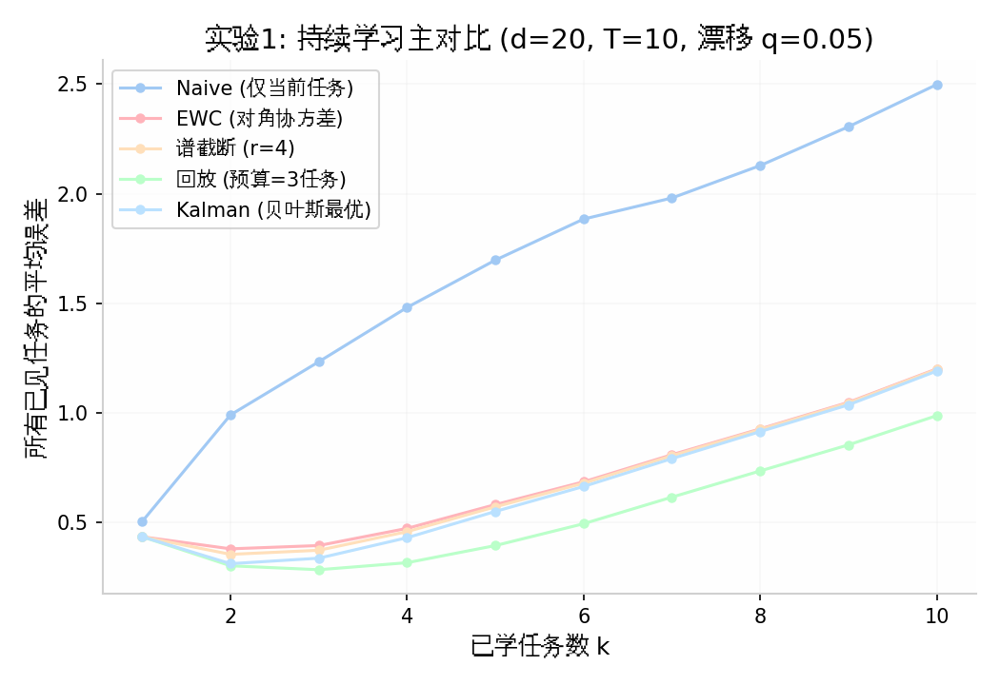
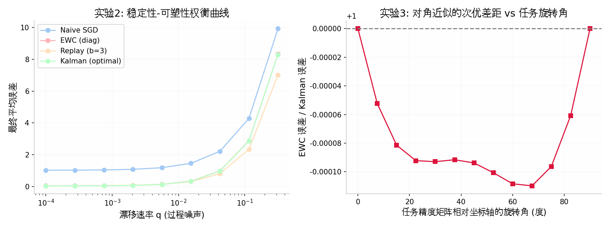
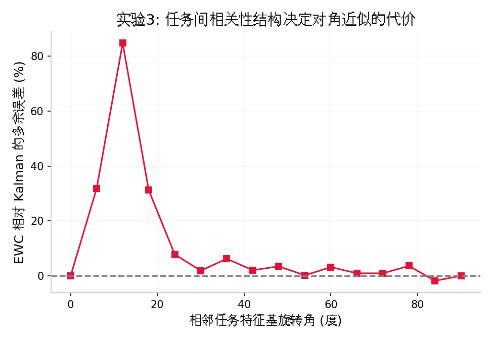
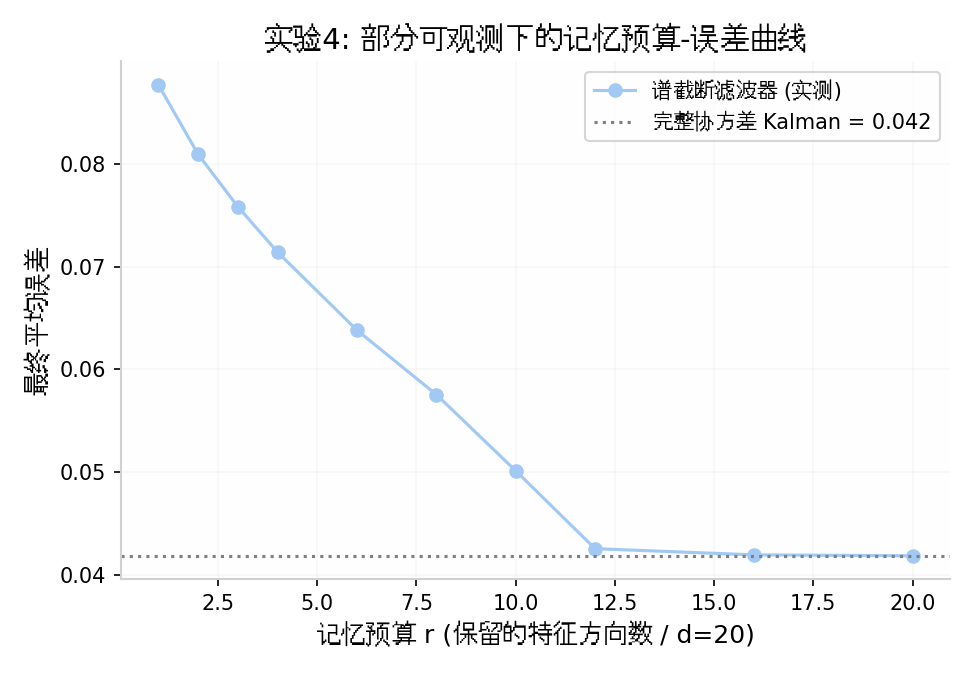

# 线性-高斯持续学习（LGCL）：一个最小可解模型及其对持续学习的统一含义

**技术备忘录 · 论文 Section 2–3 底稿 · 2026-08**

## 0. 定位

持续学习过去二十年产出的是一堆算法的集合（EWC、SI、MAS、GEM、回放族、结构族……），缺一个"最小可解模型"把这些方法变成同一最优解的不同近似，并让每种近似的信息损失可解析计算。控制论有 LQR，序贯决策有 bandit，统计物理有 Ising——本文提出持续学习的对应物：**线性-高斯持续学习（Linear-Gaussian Continual Learning, LGCL）**。

LGCL 的核心性质：**贝叶斯最优解是卡尔曼滤波器，且是精确的、闭式的**。于是：

- 每个现有方法 = 最优滤波器的一种特定信息压缩，其信息损失可精确量化（Blackwell 序实例化）；
- 稳定性-可塑性权衡 = Kalman 增益，是漂移噪声与观测噪声之比的解析函数；
- 记忆预算-遗忘的兑换 = 高斯率失真问题，最优记忆结构由逆向注水给出；
- 快/慢时间尺度分离 = 多速率 Kalman 滤波，其增益可证。

## 1. 模型定义

**潜状态（漂移）**：$\theta \in \mathbb{R}^d$ 在任务间做高斯随机游走

$$\theta_{k+1} = \theta_k + w_k,\quad w_k \sim \mathcal{N}(0, qI)$$

$q$ 是**环境漂移速率**（过程噪声），刻画任务序列的非平稳性。$q=0$ 退化为经典持续学习（固定任务参数、逐任务观测）。

**任务与观测**：任务 $k$ 提供 $n$ 个样本 $y_i = x_i^\top \theta_k + \varepsilon_i$，$\varepsilon_i \sim \mathcal{N}(0, \sigma^2)$，$x_i \sim \mathcal{N}(0, \Sigma_k)$。任务的充分统计量是 OLS 估计 $\hat\theta_k$，它是 $\theta_k$ 的测量，精度矩阵为

$$J_k = \frac{n}{\sigma^2}\Sigma_k$$

**任务结构全部编码在 $\{\Sigma_k\}$ 的谱与特征基中**：谱的衰减决定任务的有效秩（信息集中在多少方向上）；特征基之间的相对旋转决定任务间的相关结构。

**约束**：学习者只能顺序访问任务，记忆预算受限（$m$ 个样本，或 $r$ 维统计量）。

**性能度量**：任务 $j$ 的误差为 $e_j(k) = (\hat\theta^{(k)} - \theta_j)^\top \Sigma_j (\hat\theta^{(k)} - \theta_j)$（按该任务的输入分布加权——函数空间误差而非参数空间误差）。遗忘量 $= \frac{1}{T-1}\sum_j [e_j(T) - e_j(j)]$。

## 2. 最优解与方法的精确对应

### 2.1 贝叶斯最优 = Kalman 滤波

LGCL 是线性-高斯状态空间模型，其后验推断由 Kalman 滤波精确给出（信息形式）：

$$\text{预测： } P \leftarrow P + qI \qquad \text{更新： } P^{-1} \leftarrow P^{-1} + J_k,\quad \theta \leftarrow P\,(P^{-1}_{\text{pred}}\theta + J_k \hat\theta_k)$$

### 2.2 现有方法 = 最优滤波的信息压缩

| 持续学习方法 | LGCL 中的精确对应 | 压缩掉的信息 |
|---|---|---|
| Naive SGD（无保护） | 仅当前测量：$\theta = \hat\theta_k$ | 全部历史 |
| **EWC**（对角 Fisher） | **协方差对角化的 Kalman 滤波**：每步将 $P$ 投影到对角阵 | 参数间相关性（$P$ 的非对角元） |
| SI / MAS（过程量重要性） | 其他形状的协方差草图 | 同上，权重估计路径不同 |
| 经验回放（预算 $b$） | 保留最近 $b$ 个任务的测量，融合时做**陈旧度膨胀**：$J_j^{-1} \rightarrow J_j^{-1} + (k-j)qI$ | 只保样本不保协方差结构，且有预算上限 |
| 谱截断（本文） | 每步将 $P$ 投影到 top-$r$ 特征方向，弃方向按均值摊平（逆向注水） | 低特征值方向的后验精度 |

注意 EWC 一行：**"对角 Fisher 惩罚"在 LGCL 中不是一个正则化技巧，而是 Kalman 滤波的一种特定近似**——Laplace 近似在高斯情形下是精确的，EWC 推导链中"被迫的每一步"在这里都是恒等式。这是 LGCL 作为理论工具的核心价值：它把启发式方法的"近似损失"从实验问题变成计算问题。

## 3. 实验与四个结构性发现

所有实验为蒙特卡洛平均（120–400 次独立运行），代码见附件 `lgcl_toy.py`。

### 发现 1（实验 1，主对比）：高维随机任务下对角近似几乎无损

| 方法 | 最终平均误差 | 遗忘量 |
|---|---|---|
| Naive | 2.498 | 2.217 |
| EWC（对角） | 1.201 | 1.040 |
| 谱截断（r=4/20） | 1.199 | 1.040 |
| 回放（b=3，额外记忆） | 0.988 | 0.748 |
| Kalman（最优） | 1.192 | 1.034 |

- 在 $d=20$、任务特征基随机旋转的设定下，**对角协方差（EWC）与完整 Kalman 的差距 <1%，甚至 4/20 维的谱截断也无损**——随机旋转在高维下把后验协方差"洗"得接近各向同性（测度集中），这正是"高维祝福"在持续学习中的定量体现。
- 回放表现优于纯在线 Kalman 并非矛盾：它使用了**额外记忆**且将工作点向稳定性侧移动（对旧任务的评估有利、对当前跟踪有害）——回放本质是在稳定性-可塑性曲线上换工作点，而非突破曲线。
- Kalman 自身也有显著"遗忘"：其中相当部分是**漂移造成的不可约信息过时**，而非估计失败。这提示社区通用的遗忘度量混淆了两个成分（见 §5 的分解建议）。

### 发现 2（实验 2）：稳定性-可塑性是漂移速率的解析函数

（左图）

扫描 $q \in [10^{-4}, 10^{-0.5}]$：所有方法的误差随漂移单调上升；Kalman 在每个 $q$ 处自动实现最优权衡（增益 $= f(q/\sigma^2)$）；Naive 仅在极大漂移下逼近最优——因为那时旧信息本来就无价值。**推论：评估任何 CL 方法必须报告其所处的 $q$ 工作点；在 $q$ 大的环境里，防遗忘机制的收益趋于零。**

### 发现 3（实验 3）：对角近似的代价在任务"中度错位"时最大（非单调）

$d=2$、任务特征基逐任务旋转角 $\alpha$ 扫描：EWC/Kalman 的多余误差在 $\alpha \approx 12°$ 处达到峰值 **+85%**，在 $\alpha = 0°$（基对齐，对角精确）与 $\alpha = 90°$（2D 中等于轴交换，仍对角）处归零。

这给出了 Goldfarb–Hand 等人"中度相似任务遗忘最重"现象的一个机制性解释：**遗忘的热点不在任务差异最大处，而在任务相关结构恰好使坐标基近似失真最大处**。它也直接预测：K-FAC 式块结构近似相对对角近似的收益，应当是任务错位程度的单峰函数。

### 发现 4（实验 4）：记忆预算是否起作用，取决于任务的可观测性

- **完全观测**（每任务的 $J_k$ 满秩且信息充足）：误差对预算 $r$ 几乎平坦——当前任务的新鲜测量可以重新供给所有方向，记忆约束不起作用。
- **部分观测**（每任务只见 $8/20$ 维子空间）：误差随 $r$ 单调下降、在 $r \approx 12$ 处饱和到完整 Kalman 水平——**旧方向的信息只能来自记忆，预算成为硬约束**。

**推论：持续学习中"记忆有没有用"不是一个算法问题，而是一个任务结构问题。** 这解释了文献中回放/正则收益在不同基准上互相矛盾的报告：permuted MNIST（每任务接近完全观测）与 split 类基准（部分观测）处于本曲线的两个不同 regime。

## 4. 定理路线图

- **T1（近似差距刻画）**：LGCL 上 EWC（对角投影 Kalman）相对最优的次优差距，作为任务特征基夹角谱与 $q/\sigma^2$ 的闭式函数。实验 3 的曲线即其 2D 显影；一般维度的严格界是首个定理目标。
- **T2（遗忘的基本极限）**：给定记忆率 $R$（比特）与漂移速率 $q$，任何方案的旧任务误差下界 $= $ 高斯率失真 $D(R)$ + 漂移滞后项 $\text{tr}(\Sigma_j \cdot (T-j)qI)$。这把 Chen–Papadimitriou–Peng（FOCS 2022）的离散记忆下界推广到连续有损设定，并使下界可画图、可被所有方法对照。
- **T3（快慢分离的可证明增益）**：当任务精度矩阵具有低秩 + 各向同性噪声结构时，两时间尺度滤波器（慢变量承载共享子空间）相对单尺度滤波器的增益可严格界定——"低有效秩世界里快慢架构最优"的定理形式。

## 5. 对领域的可立即执行建议

1. **遗忘度量分解**：报告的遗忘应拆分为"不可约漂移项"（环境自己变了）与"估计恶化项"（方法的责任）。LGCL 中两者均可解析计算；深度基准上至少应报告一个漂移参考线的代理。
2. **报告任务可观测性**：基准的任务精度谱（每任务数据覆盖了参数空间的哪些方向）应作为基准卡（benchmark card）的标准字段——它决定了该基准处于发现 4 曲线的哪个 regime，从而决定各类方法的预期收益排序。
3. **滤波器视角的诊断**：任何基于重要性加权的正则方法，其对角近似的失真度可用"任务特征基与坐标基的主夹角"快速预估（发现 3）；夹角大时应预期 K-FAC/块结构方法有数量级优势。

## 6. 与现有理论文献的关系

- 线性模型遗忘界（Evron, Soudry, Srebro 等，COLT 2022 起）：给出最坏情形界；LGCL 给出**贝叶斯典型情形的完整解**，两者互补。
- 随机正交任务的过参数化分析（Goldfarb & Hand 2023–2024）：LGCL 的 $\{\Sigma_k\}$ 旋转设定是其向"任意谱 + 任意相关结构"的推广，发现 3 与其"中度相似遗忘最重"互为印证。
- 记忆下界（Chen–Papadimitriou–Peng, FOCS 2022）：证明精确零遗忘所需记忆随任务数增长；T2 将其嵌入率失真框架，允许有损遗忘与连续预算。
- 在线结构化 Laplace（Ritter et al. 2018）：已指出 Laplace 更新与 Kalman 更新的联系；LGCL 把这一联系从"方法灵感"升级为"所有方法的统一坐标系"。

## 7. 复现信息

- 代码：`lgcl_toy.py`（纯 numpy，CPU 秒级运行）
- 数值结果汇总：`lgcl_results.json`
- 图：`fig1_main.png`、`fig23_drift_rotation.png`、`fig3_rotation_gap.png`、`fig4_rate_distortion.png`
